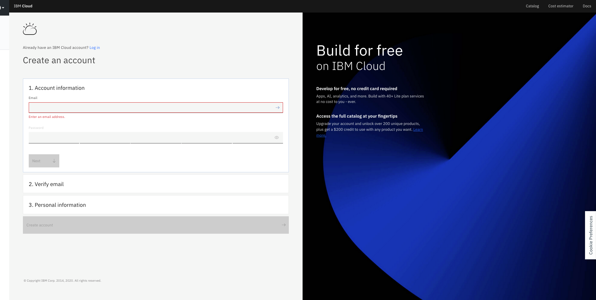
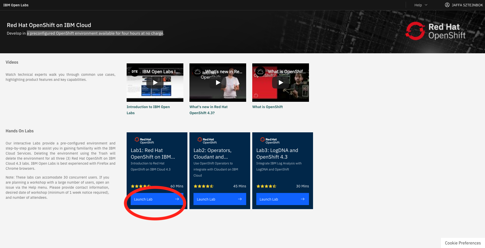
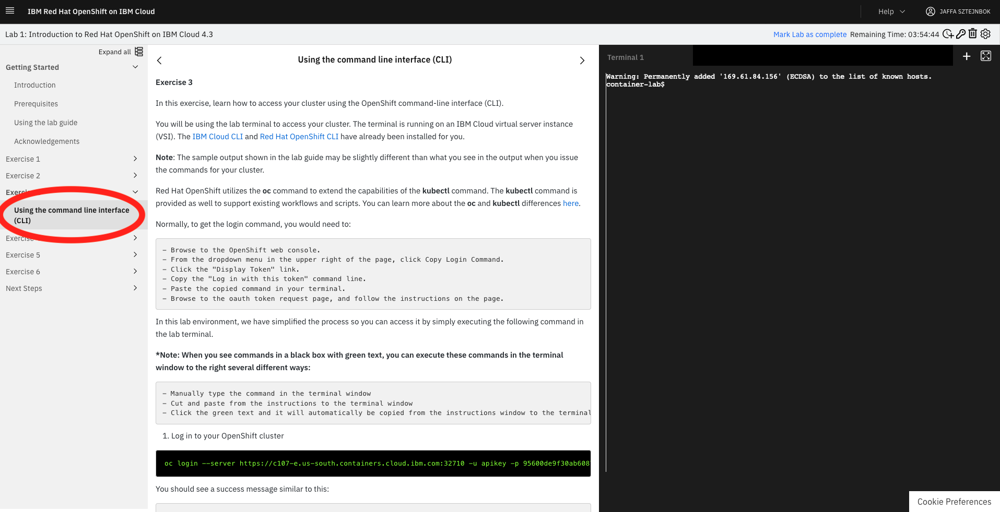

# 1. Register to IBM Cloud 

[Register IBM Cloud](http://ibm.biz/tlv-06-08-2020-openshift101)

Please make sure to run all steps to get a valid IBM Lite Cloud account 

# 2. Get a preconfigured OpenShift environment available for four hours at no charge
1. [access to IBM Openshift  Cluster]( https://developer.ibm.com/openlabs/openshift)

2. Click on the Lunch Lab of Lab1   

A cluster will be allocated for you , this might take a few secounds.... 
( optional not part of the workshop  : you may run Lab 1 ,2 ,3 to learn about Openshift ) 

3. click on Exercise 3 in Lab 1 

4. click on Using the command line interface (CLI) 

 
# FROM this point on
you will be using the lab terminal to access your cluster. The terminal is running on an IBM Cloud virtual server instance (VSI). The IBM Cloud CLI and Red Hat OpenShift CLI  and KUBECTL CLI have already been installed for you. 
 
# Step 3. Login to IBMCLOUD and your Openshift cluster 
 
1. On the Terminal (at the right side of the screen) log in to the IBM Cloud CLI: `ibmcloud login -a cloud.ibm.com -r eu-gb -g default`.
2. Enter your IBM Cloud credentials when prompted.
2. When creating a project (exercise 1 ) please add your initials to the name example-healthxx  so you will have a unique project (as  it is possible that you will share your cluster with another student ) 

3. In Exercise 4 ( enable auroscaler ) please notice to update the correct namespace (line5 ) and Deployment name (node-s-2-i-openshift instaed of example  )  https://ibm-developer.gitbook.io/openshift101/workshop/exercise-04#enable-autoscaler 

4. You could also run Exercise 6 . For that you will need to either use cloudshell with https://shell.cloud.ibm.com/ and install Docker there , or go over the [Setup CLI Access for the cluster](https://ibm-developer.gitbook.io/openshift101/getting-started/setup_cli) and then install Docker 
# The LAB 
[OpenShift 101: Learn the Basics of Red Hat OpenShift on IBM Cloud](https://ibm-developer.gitbook.io/openshift101/)

# Usefull Links :

[Call for Code](https://developer.ibm.com/callforcode/)

[IBM Developer Website](https://developer.ibm.com/)

[Watson Services](https://cloud.ibm.com/catalog?category=ai)

[IBM Cloud Dashboard](https://cloud.ibm.com/)

[OpenShift Labs](https://github.com/openshift-labs/starter-guides)

[Cloud Pak for Data](https://www.ibm.com/products/cloud-pak-for-data )
