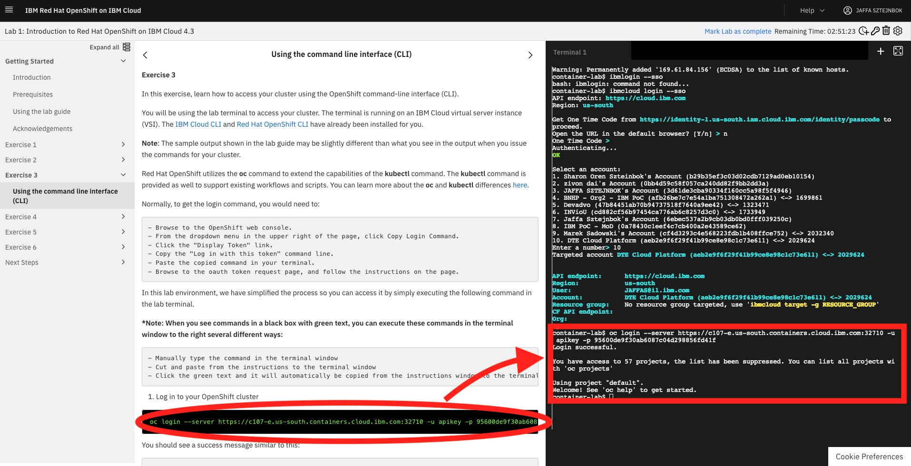

# Register to IBM Cloud 

[Register IBM Cloud](http://ibm.biz/tlv-06-08-2020-openshift101)

Please make sure to run all steps to get a valid IBM Lite Cloud account 


# Get a preconfigured OpenShift environment available for four hours at no charge
1. [access to IBM Openshift  Cluster]( https://developer.ibm.com/openlabs/openshift)

2. Click on the Lunch Lab of Lab1   


A cluster will be allocated for you , this might take a few secounds.... 
( optional not part of the workshop  : you may run Lab 1 ,2 ,3 to learn about Openshift ) 

3. click on Exercise 3 in Lab 1 

4. click on Using the command line interface (CLI) 


 
# FROM this point on
you will be using the lab terminal to access your cluster. The terminal is running on an IBM Cloud virtual server instance (VSI). The IBM Cloud CLI and Red Hat OpenShift CLI  and KUBECTL CLI have already been installed for you. 
 
# Login to IBMCLOUD and your Openshift cluster 
 
1. On the Terminal (at the right side of the screen) log in to the IBM Cloud CLI: `ibmcloud login -a cloud.ibm.com -r eu-gb -g default`.
2. Enter your IBM Cloud credentials when prompted.
  **Note:** If you have a federated ID, use `ibmcloud login --sso` to log in to the IBM Cloud CLI. Enter your user name, and use the provided URL in your CLI output to retrieve your one-time passcode. You know you have a federated ID when the login fails without the `--sso` and succeeds with the `--sso` option.
  
3. Select an account Enter a number : `the number of DTE Cloud Platform probably 2  `  ( account where your preconfigured cluster is)   
 
# Configure Kubectl to point to IBM Cloud Kubernetes Service
1. List the clusters in your account:

```shell
ibmcloud ks clusters
```

2. Set an environment variable that will be used in subsequent commands in this lab.

```shell
export CLUSTER_NAME=<your_cluster_name>
```

3. Configure `kubectl` to point to your cluster
```shell
ibmcloud ks cluster config --cluster $CLUSTER_NAME
```
4. Log in to your OpenShift cluster ====> click on the  LAB 1 Excersie 3  step 1 , this will run the oc login command with your keys and cluster details 


5. Validate proper configuration
```shell
kubectl get namespace
```
You should see output similar to the following, if so, then your're ready to continue.

```shell
NAME              STATUS   AGE
default           Active   125m
ibm-cert-store    Active   121m
ibm-system        Active   124m
kube-node-lease   Active   125m
kube-public       Active   125m
kube-system       Active   125m
```

# Download the Workshop Source Code
Repo `guestbook` has the application that we'll be deploying.
While we're not going to build it we will use the deployment configuration files from that repo.
Guestbook application has two versions v1 and v2 which we will use to demonstrate some rollout
functionality later. All the configuration files we use are under the directory guestbook/v1.

Repo `kube101` contains the step by step instructions to run the workshop.

```shell
git clone https://github.com/IBM/guestbook.git
git clone https://github.com/IBM/kube101.git
```

 
 
 
# The LAB 
From this point on run Lab1 , Lab2 , Lab3 from (https://github.com/IBM/kube101/tree/master/workshop/Lab1)
[OpenShift 101: Learn the Basics of Red Hat OpenShift on IBM Cloud](https://ibm-developer.gitbook.io/openshift101/)

